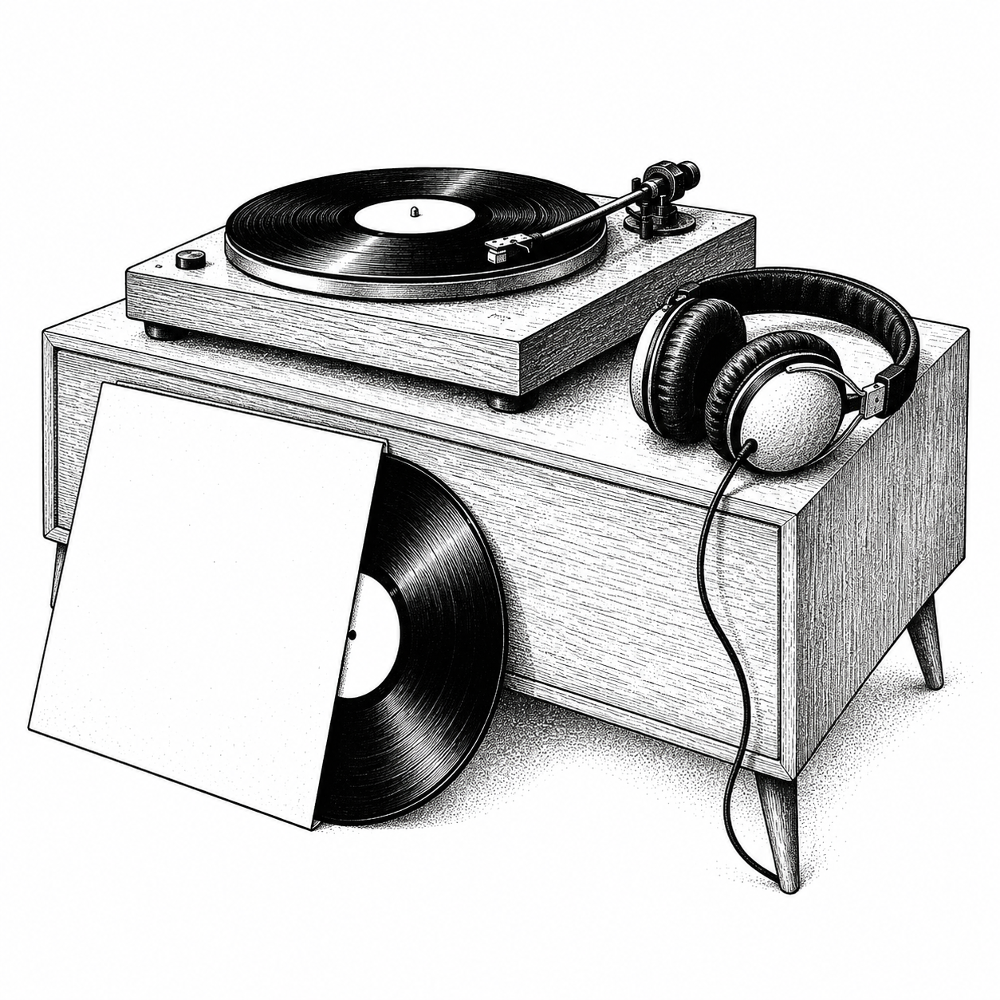
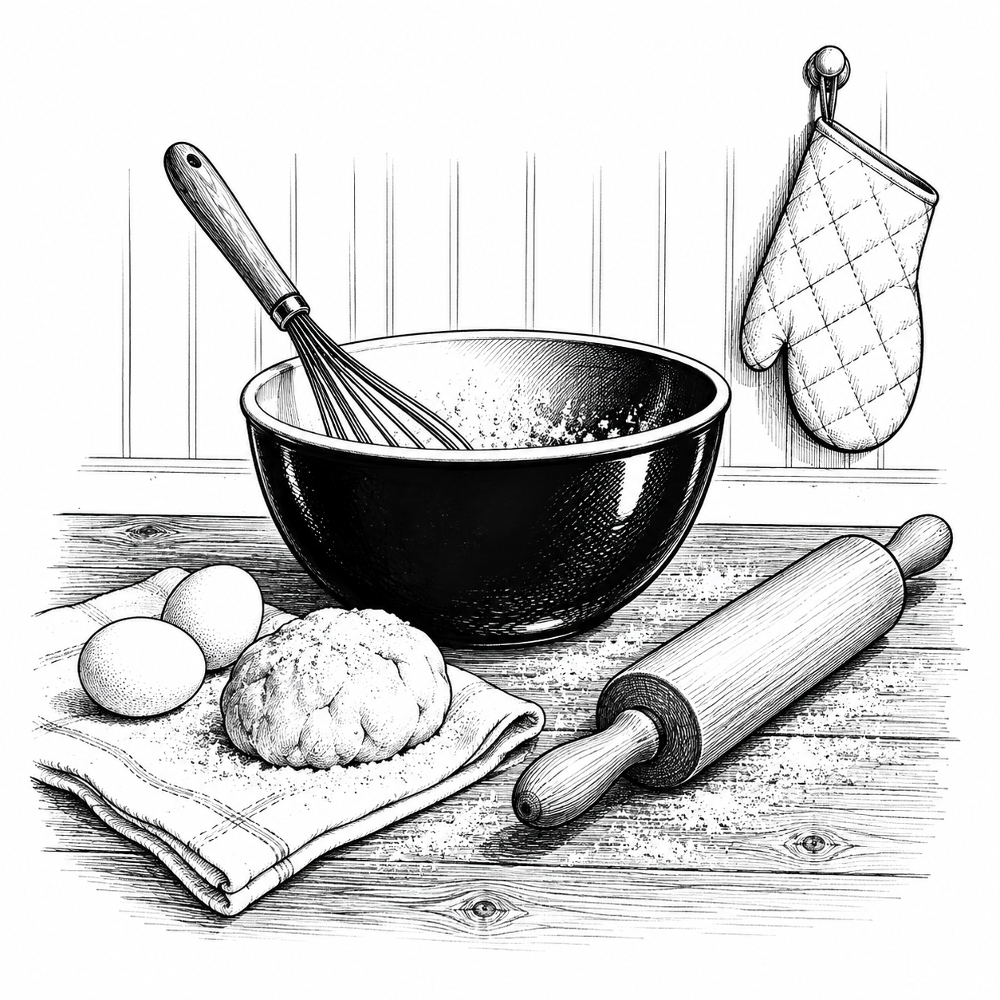
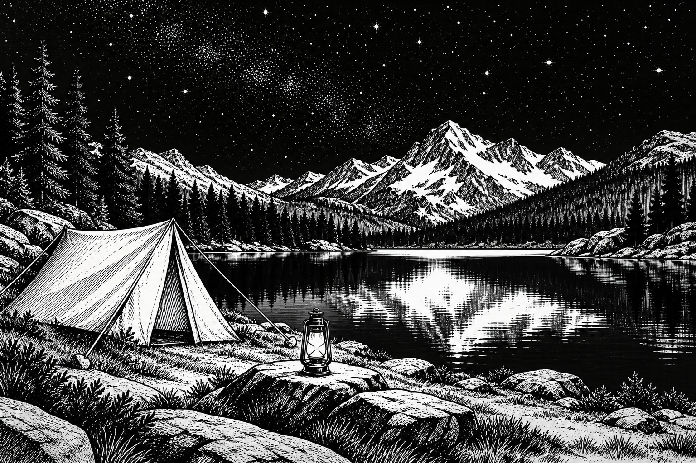

# Inkbit Illustration · 墨点イラスト

[简体中文](README.md) · [繁體中文](README.zh-TW.md) · [English](README.en.md) · [日本語](README.ja.md) · [한국어](README.ko.md)

Inkbit の白黒インクイラストを制作・編集します。輪郭、点描、短いハッチング、余白を用いたキービジュアルや挿絵向けです。一般的なサイト改修や正確な UI・ロゴの再現には使用しません。


## 選定された作例








[Image prompts](skills/inkbit-illustration/references/selected-gallery.md) · MU Labs / Inkbit Illustration · CC BY 4.0


## インストールと使用

`skills/inkbit-illustration` フォルダー全体をホストのスキル保存先へコピーします。一つだけインストールしてください。既定は簡体字中国語で、繁体字中国語、英語、日本語、韓国語でも依頼できます。

```text
$inkbit-illustration を使って旅行をテーマにした白黒の点描イラストを描いてください。文字は不要です。
```

[Skill](skills/inkbit-illustration/SKILL.ja.md) · [Gallery / 图集](skills/inkbit-illustration/references/gallery.md)

## ライセンス

再利用・改変時は MU Labs / Inkbit Illustration、出典、CC BY 4.0 リンクを表示し、変更を明記してください。

[NOTICE](NOTICE.md) · [CC BY 4.0](https://creativecommons.org/licenses/by/4.0/) · [Source](https://github.com/mustundead/inkbit-illustration-skill)
