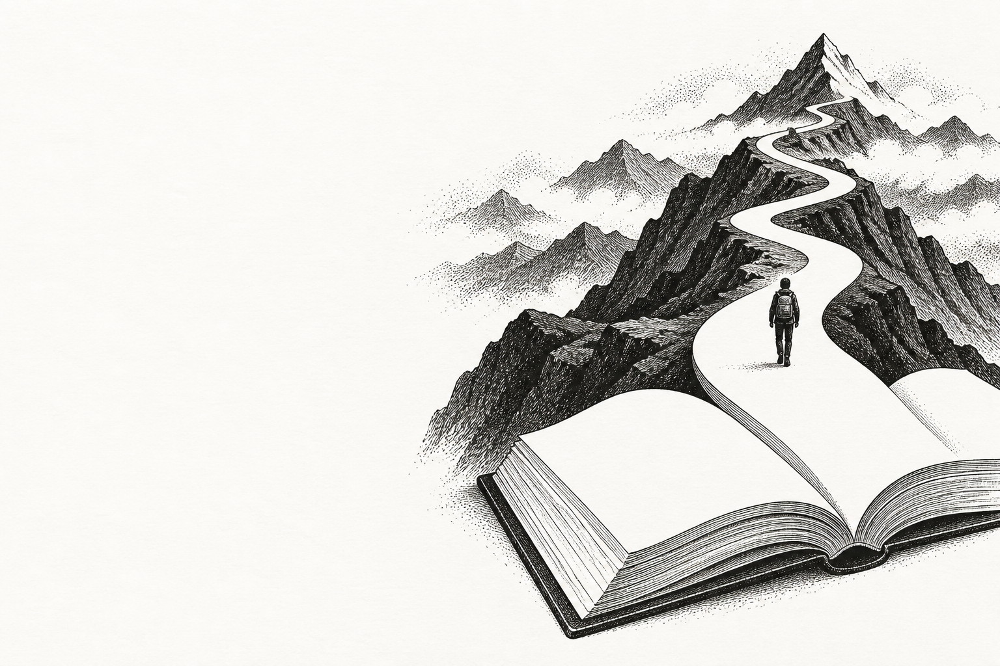
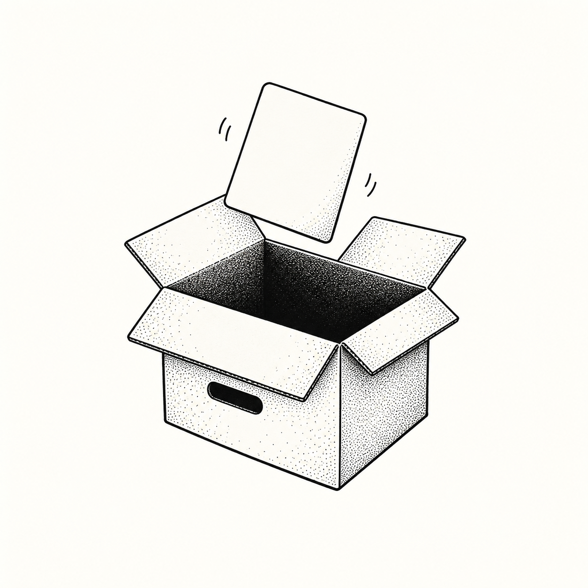
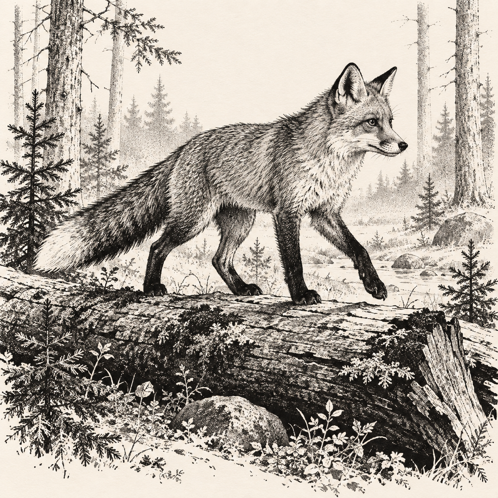
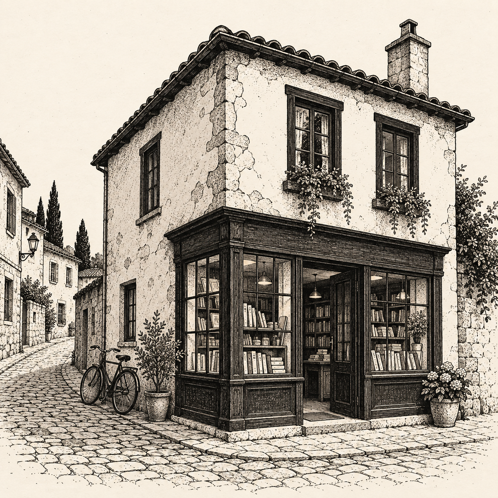
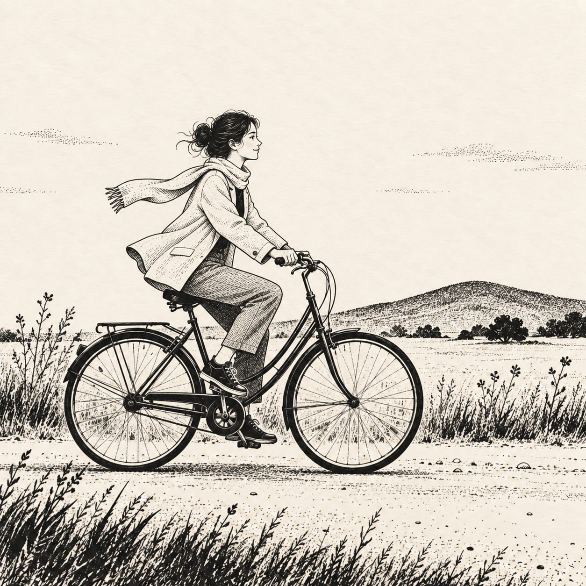
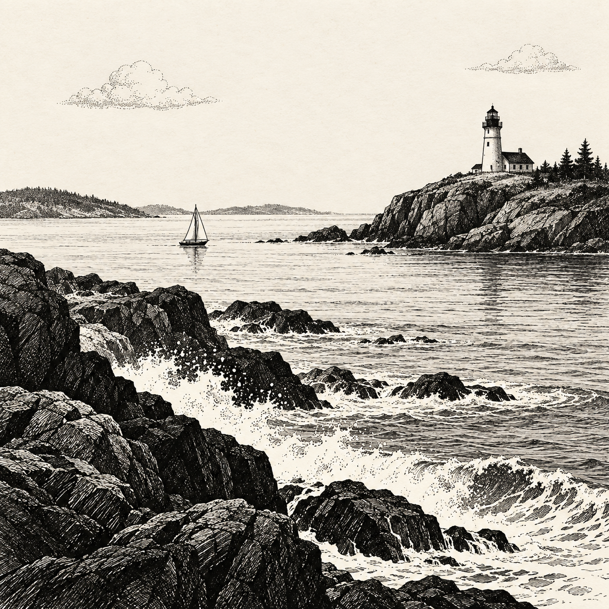

# Subject gallery

[简体中文](gallery.zh-CN.md) · [Back to the skill](../SKILL.md)

Six subjects share one ink vocabulary. Look at how black masses, short hatching, stippling and blank paper change with material and composition. These are mark-making examples, not mandatory subjects.

The images are AI-generated and visually inspected as illustrations, not anatomy, engineering or accurate-lettering references. The prompts below are the actual generation inputs; [the prompt record](gallery-prompts.json) also includes reusable Chinese translations, which were not rendered separately.

## Reading and discovery



A reading-app hero: the page becomes a path; left-side space accommodates a heading.

```text
Create an Inkbit illustrated hero for a reading or knowledge app: an open book in the lower right becomes a winding white path extending seamlessly out of its pages toward a small distant mountain peak. A tiny traveler seen from behind walks up that path, showing discovery through reading. Strong elegant visual metaphor, restrained surreal editorial composition. LEFT THIRD stays completely empty near-white paper for real heading text; artwork occupies right two thirds. Landscape 3:2 composition. Black ink on subtle near-white warm paper only. Confident dry irregular ink contours, bold black mountain shadow planes, irregular stipple density and short directional hatching; white path reads crisply through dark terrain. Mid-level illustration detail, not photograph engraving and not childish clipart. Book perspective plausible, no printed marks or fake letters on pages. No coffee, food, mushrooms, plants-as-decoration, badges, logos, text, borders, sepia ink, glossy 3D or uniform grain. Quiet adventurous mood, useful product illustration, single coherent scene.
```


## Empty collection



An empty-state illustration for files, saved items or notes; keep status copy in the interface.

```text
Create a practical app empty-state illustration for an empty collection, files or notes page. One open compact cardboard archive box in a slightly elevated three-quarter view, with a single blank rounded-corner paper card hovering just above its opening at a gentle angle. Clear empty interior, believable box perspective, two small short motion strokes near card. Compact centered composition occupying about half a square canvas, generous clean near-white warm paper margins suitable for placing real UI copy below. Inkbit black ink illustration: appealing confident gently irregular contours, solid black interior shadow, white paper planes, selective varied-density stippling and tiny form-following short hatching only under box flaps. Graphic and warm, immediately readable at small display size. No landscape, no plants, no creatures, no ornate decoration, no written text, no lettering, no logos, no colored accents, no simulated UI or buttons, no all-over paper noise, no realistic photo shading. Finished standalone illustration, not a multi-panel mockup.
```


## Fox in the woods



Silhouette and directional strokes carry fur, balance and movement.

```text
Create a finished square editorial illustration in the Inkbit style: warm off-white paper and black ink only, confident irregular dry-ink contours, substantial solid black shapes balanced with clean paper highlights, varied-density hand stippling and short form-following hatching. A vintage printed pen-and-ink illustration with tiny rough ink dots, not smooth grey airbrush, not a uniform noise filter, not a woodgrain overlay, not a pixel grid, not glossy 3D, no colored accents. Clear silhouette at thumbnail size and carefully composed negative space. No decorative frame, no letters, no labels, no watermark, no signature. This is one standalone illustration, not a collage or multi-panel sheet. A small alert red fox, rendered entirely in black ink and white paper without orange, walking across a fallen log in a quiet woodland clearing. Full body natural fox anatomy, two paws visibly bearing weight on the log, the other paws in a plausible walking step; bushy tail balances behind. Delicate fir saplings and distant pale trunks, not dense wall-to-wall trees. Fox looking ahead. Fur transitions through directional short strokes.
```

## Corner bookshop



Ink values separate plaster walls, timber frames and cobblestones.

```text
Create a finished square editorial illustration in the Inkbit style: warm off-white paper and black ink only, confident irregular dry-ink contours, substantial solid black shapes balanced with clean paper highlights, varied-density hand stippling and short form-following hatching. A vintage printed pen-and-ink illustration with tiny rough ink dots, not smooth grey airbrush, not a uniform noise filter, not a woodgrain overlay, not a pixel grid, not glossy 3D, no colored accents. Clear silhouette at thumbnail size and carefully composed negative space. No decorative frame, no letters, no labels, no watermark, no signature. This is one standalone illustration, not a collage or multi-panel sheet. A charming small two-storey corner bookshop on a narrow cobblestone street. Old plaster walls, dark timber window frames, an open doorway, books visible as simple spines in the display window, a bicycle leaning firmly against the side wall, and two modest plant pots. Three-quarter architectural perspective with believable aligned windows and straight walls. No lettering or signs. Clean sky and generous margins.
```

## An afternoon ride



Pose and trailing fabric suggest movement without obscuring the figure.

```text
Create a finished square editorial illustration in the Inkbit style: warm off-white paper and black ink only, confident irregular dry-ink contours, substantial solid black shapes balanced with clean paper highlights, varied-density hand stippling and short form-following hatching. A vintage printed pen-and-ink illustration with tiny rough ink dots, not smooth grey airbrush, not a uniform noise filter, not a woodgrain overlay, not a pixel grid, not glossy 3D, no colored accents. Clear silhouette at thumbnail size and carefully composed negative space. No decorative frame, no letters, no labels, no watermark, no signature. This is one standalone illustration, not a collage or multi-panel sheet. A young adult wearing a loose jacket and trousers riding a simple city bicycle from left to right along a gentle path. Natural profile pose, hands accurately resting on handlebars, feet on pedals, two round wheels aligned along ground, a light scarf and jacket hem trailing gently to suggest motion. Minimal distant grasses and one low rolling hill, generous empty sky. Face a few restrained ink marks, not photorealistic. Plausible bicycle geometry, no text or logos.
```

### Final character revision

```text
Edit this illustration, improving only the rider's character design while preserving the bicycle, composition, landscape and warm ivory/black ink style. Make the adult woman charming and graceful in a refined illustrated storybook/editorial manner: soft clean facial profile, delicate short nose, gently curved jaw, relaxed subtle smile, expressive simple eye, natural neck and proportions. Neatly gathered loose hair with just a few windblown wisps. Light elegant jacket with a clear silhouette and broad paper-white areas instead of dense scratchy fabric shading; tapered trousers, simple shoes and trailing light scarf. Maintain plausible seated cycling posture, hands actually gripping handlebars and feet contacting pedals. Restrained contour and form-following short hatch marks, variable stipple, strong black hair and balanced black accents. Avoid harsh angular face, heavy cheek shading, cluttered wrinkles, glamour makeup, anime eyes, photorealistic face, glossy shading or any color. Keep the exact square crop and background. Deliver one finished image.
```

## Headland lighthouse



Dark foreground and light distance establish depth; blank paper becomes water and air.

```text
Create a finished square editorial illustration in the Inkbit style: warm off-white paper and black ink only, confident irregular dry-ink contours, substantial solid black shapes balanced with clean paper highlights, varied-density hand stippling and short form-following hatching. A vintage printed pen-and-ink illustration with tiny rough ink dots, not smooth grey airbrush, not a uniform noise filter, not a woodgrain overlay, not a pixel grid, not glossy 3D, no colored accents. Clear silhouette at thumbnail size and carefully composed negative space. No decorative frame, no letters, no labels, no watermark, no signature. This is one standalone illustration, not a collage or multi-panel sheet. A dramatic but peaceful coastal headland landscape: a small white lighthouse on a distant rocky promontory at upper right, a tiny sailboat crossing a calm inlet in the middle distance, jagged dark foreground rocks at lower left and sweeping white waves. Layered depth through ink density. Sky occupies upper third with just two small clouds and abundant blank paper, no sunburst. Sea marked with sparse horizontal strokes, rocks with dense short hatching.
```

## Attribution

MU LABS / MU LABS Inkbit Illustration · [Source](https://github.com/mustundead/inkbit-illustration-skill) · [CC BY 4.0](https://creativecommons.org/licenses/by/4.0/)

Retain attribution, source and license links when reusing or adapting, and describe changes. See [NOTICE](../NOTICE.md) for the rights scope.
