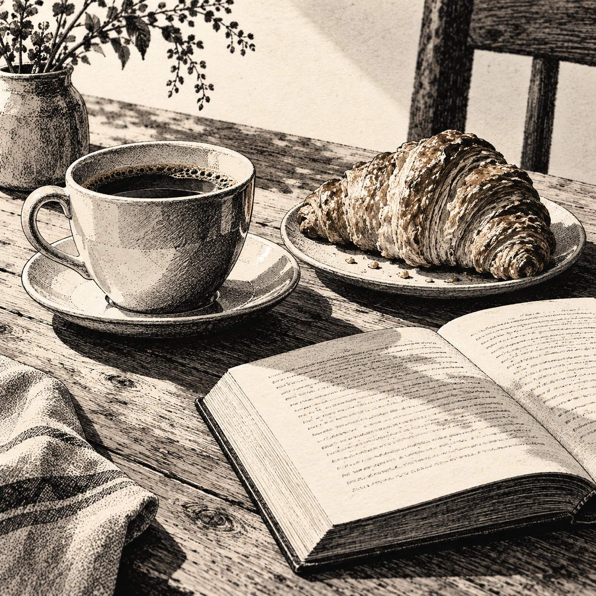
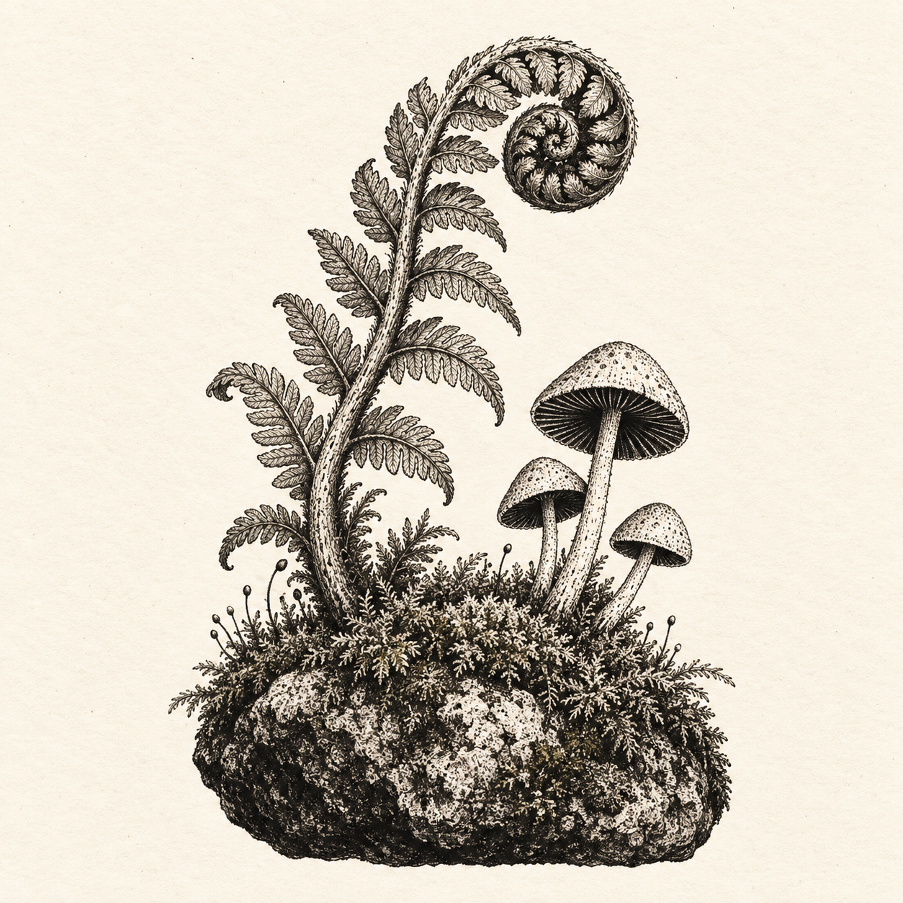

# 题材画廊

[English](gallery.md) · [回到 Skill](../SKILL.zh-CN.md)

六种题材，同一套墨线语言。重点观察黑色块面、短排线、疏密点阵和留白如何随材质与构图变化。示例展示画法，不要求复刻其中的物品、人物或场景。

图片由 AI 生成，已做视觉检查；不作为解剖、工程结构或准确文字的参考。早餐书页中的笔画是装饰纹理。以下中文提示词是实际英文生成输入的译写版，未经单独生成验证；完整原始输入见 [提示词记录](gallery-prompts.json)。

## 桌上的早餐



用不同点阵密度区分陶瓷、酥皮和纸张。

```text
正方形 Inkbit 墨点插画。暖白纸面与黑墨，以略干涩的轮廓、明确黑色块面、随形短排线和疏密点阵塑造形体。缩小时轮廓仍清楚，保留呼吸感。不使用彩色强调、平滑灰色渐变、统一噪点滤镜或光滑 3D 质感。不加边框、文字、水印或签名。画一杯放在杯碟上的咖啡、一块盘中的羊角面包和一本摊开的书。三分之四视角，安静的早餐桌。用留白表现陶瓷反光，用短线表现酥皮，用较浅纹理表现纸张。
```

## 蕨叶与蘑菇



以细排线描叶脉，用疏密点阵表现苔藓。

```text
正方形 Inkbit 墨点插画。暖白纸面与黑墨，以略干涩的轮廓、明确黑色块面、随形短排线和疏密点阵塑造形体。缩小时轮廓仍清楚，保留呼吸感。不使用彩色强调、平滑灰色渐变、统一噪点滤镜或光滑 3D 质感。不加边框、文字、水印或签名。画一株卷曲的蕨叶和长在苔藓石头上的三朵小蘑菇。作为独立植物配图，四周保留充足空白。叶脉用细线，苔藓用点阵，菌盖底部用深墨色。
```

## 林间的狐狸


靠轮廓和顺向笔触表现毛发、重心与步态。

```text
正方形 Inkbit 墨点插画。暖白纸面与黑墨，以略干涩的轮廓、明确黑色块面、随形短排线和疏密点阵塑造形体。缩小时轮廓仍清楚，保留呼吸感。不使用彩色强调、平滑灰色渐变、统一噪点滤镜或光滑 3D 质感。不加边框、文字、水印或签名。画一只狐狸走过林间倒木。完整侧面身体，脚掌与木头的接触可信，抬脚形成自然步态，蓬松尾巴保持平衡。毛发用顺着身体方向的短线，远处树干保持浅淡。
```

## 街角书店


用墨色层次区分墙面、木框与石板路。

```text
正方形 Inkbit 墨点插画。暖白纸面与黑墨，以略干涩的轮廓、明确黑色块面、随形短排线和疏密点阵塑造形体。缩小时轮廓仍清楚，保留呼吸感。不使用彩色强调、平滑灰色渐变、统一噪点滤镜或光滑 3D 质感。不加边框、文字、水印或签名。画一间街角的两层书店，三分之四建筑视角。灰泥墙、深色木窗框、打开的门、橱窗里的书、自行车和少量盆栽。墙面与窗框透视一致，不生成招牌文字。
```

## 骑行的午后


通过姿态和衣摆表现动感，纹理不盖过人物轮廓。

```text
正方形 Inkbit 墨点插画。暖白纸面与黑墨，以略干涩的轮廓、明确黑色块面、随形短排线和疏密点阵塑造形体。缩小时轮廓仍清楚，保留呼吸感。不使用彩色强调、平滑灰色渐变、统一噪点滤镜或光滑 3D 质感。不加边框、文字、水印或签名。画一个穿宽松外套的人从左向右骑自行车。侧面视角，手扶车把，双脚踩踏板，车轮落地。围巾和衣摆轻轻向后扬起，远处只有草地和低矮山丘。
```

### 人物最终修订

```text
仅调整骑行者：柔和清秀的侧脸、简洁五官、自然微笑、轻盈外套和大面积纸白，减少脸部和衣服的密集碎线。保留自行车、风景、构图、可信骑行姿态与黑白墨点风格。
```

## 海岬灯塔


前景深、远景浅，以留白表现海面与空间。

```text
正方形 Inkbit 墨点插画。暖白纸面与黑墨，以略干涩的轮廓、明确黑色块面、随形短排线和疏密点阵塑造形体。缩小时轮廓仍清楚，保留呼吸感。不使用彩色强调、平滑灰色渐变、统一噪点滤镜或光滑 3D 质感。不加边框、文字、水印或签名。画一座海岬灯塔与海湾中的小帆船。近处岩石用浓密短排线，远景墨色变浅，海面用稀疏横线，浪花和天空用纸面留白。上方留出宽阔天空。
```

## 署名

MU Labs / Inkbit Illustration · [源项目](https://github.com/mustundead/inkbit-illustration-skill) · [CC BY 4.0](https://creativecommons.org/licenses/by/4.0/)

引用或改编时保留署名、来源与许可链接，并说明修改。具体权利范围见 [NOTICE](../NOTICE.md)。
